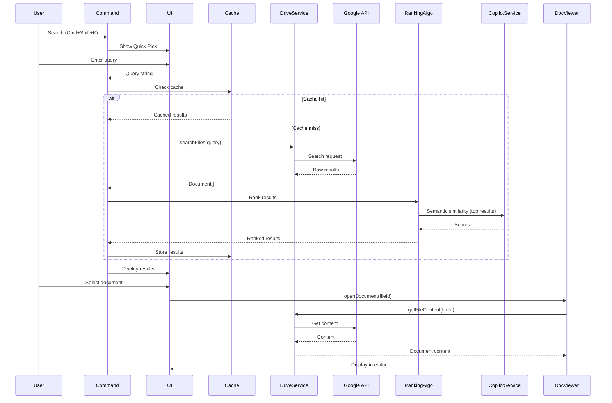

# Data Flow

## Overview

TeamBrain follows a unidirectional data flow pattern with clear separation between layers.

## Key Flows

### 1. Search Flow



### 2. Authentication Flow

```
User Action (command/activation)
    ↓
AuthManager.getSession()
    ↓
Check VS Code Auth API
    ↓
Is authenticated? ──NO──→ Trigger OAuth flow
    │                          ↓
    YES                   Open browser
    ↓                          ↓
Return existing session    Google OAuth
    ↓                          ↓
Get access token          PingID SSO
    ↓                          ↓
Initialize Drive API      Token issued
    ↓                          ↓
Ready                     VS Code stores token
                               ↓
                          Return session
```

### 3. Context Suggestion Flow

```
File opened/changed
    ↓
onDidChangeActiveTextEditor event
    ↓
Debounce (2s delay)
    ↓
ContextDetector.analyze(file)
    ↓
┌─────────────────────────────┐
│  Path analysis              │
│  Content keyword extraction │
│  Copilot topic extraction   │
└─────────────────────────────┘
    ↓
Merged keywords
    ↓
DriveService.searchFiles(keywords)
    ↓
Google API returns results
    ↓
Rank by relevance to context
    ↓
Filter to top 3-5
    ↓
Check user preferences (dismissed?)
    ↓
Show notification
    ↓
User clicks ──→ DocViewer.openDocument()
    │
User dismisses ──→ Track preference
```

### 4. Background Indexing Flow

```
Extension activation
    ↓
Read indexed folders from config
    ↓
Start background indexing
    ↓
For each folder:
    ├→ DriveService.listFolder(folderId)
    ├→ Get metadata only (not content)
    ├→ Store in WorkspaceState
    └→ Update last indexed time
    ↓
Set up periodic sync (5 min interval)
    ↓
On sync:
    ├→ DriveService.getChanges(startToken)
    ├→ Get only modified files
    ├→ Update WorkspaceState
    └→ Invalidate cache for modified files
```

### 5. AI Q&A Flow

```
User command (Cmd+Shift+?)
    ↓
Show input box
    ↓
User enters question
    ↓
Find relevant docs:
    ├→ Search Drive with keywords from question
    ├→ Rank by semantic similarity
    └→ Take top 5 docs
    ↓
Build context:
    ├→ Limit to token budget (~10k tokens)
    └→ Format: "Document: [name]\n[content]"
    ↓
Send to Copilot:
    ├→ System prompt + question + context
    └→ Stream response
    ↓
Parse response:
    ├→ Extract answer
    └→ Extract citations
    ↓
Display in webview panel:
    ├→ Answer (markdown formatted)
    └→ Clickable citations → DocViewer
```

## Caching Strategy

### Three-Tier Cache

```
┌──────────────────────────────────────┐
│  Tier 1: In-Memory Cache             │
│  - Document content                  │
│  - TTL: 1 hour                       │
│  - Eviction: LRU (max 100 docs)      │
└──────────────────────────────────────┘
              ↓ (miss)
┌──────────────────────────────────────┐
│  Tier 2: Workspace State             │
│  - Document metadata                 │
│  - Index information                 │
│  - Persistent across sessions        │
└──────────────────────────────────────┘
              ↓ (miss)
┌──────────────────────────────────────┐
│  Tier 3: Google Drive API            │
│  - Fetch from source                 │
│  - Store in Tier 1 & 2               │
└──────────────────────────────────────┘
```

### Cache Invalidation

```
File modified in Drive
    ↓
Drive API change notification
    ↓
Check if file in cache
    ↓
If yes:
    ├→ Remove from Tier 1 (in-memory)
    ├→ Update Tier 2 (workspace state) with new metadata
    └→ Next access will fetch fresh content
```

## State Management

### Extension State Lifecycle

```
Extension Activation
    ↓
Initialize AuthManager
    ↓
Check authentication status
    │
    ├─ Not authenticated → Show welcome
    │
    └─ Authenticated
         ↓
    Initialize DriveService
         ↓
    Load workspace state:
         ├─ Favorites
         ├─ Recent docs
         ├─ Access statistics
         └─ Index metadata
         ↓
    Start background indexing
         ↓
    Register commands, views, events
         ↓
    Extension ready
```

### Data Persistence

```typescript
// Recent documents (30 days)
workspaceState.update('recentDocs', [
    { id, name, accessedAt: Date.now() }
]);

// Favorites (permanent)
workspaceState.update('favorites', [
    { id, name, addedAt: Date.now() }
]);

// Access statistics
workspaceState.update('accessStats', {
    'file-id-1': { count: 5, lastAccess: Date.now() },
    'file-id-2': { count: 3, lastAccess: Date.now() }
});

// Index metadata
workspaceState.update('indexMeta', {
    'folder-id-1': { lastIndexed: Date.now(), fileCount: 234 }
});
```

## Performance Optimizations

### Request Batching

```
Multiple file metadata requests
    ↓
Queue requests
    ↓
Wait 100ms (debounce)
    ↓
Batch into single API call
    ↓
Drive API batch endpoint
    ↓
Return results
    ↓
Distribute to callers
```

### Lazy Loading

```
Search returns 50 results
    ↓
Display first 10 in Quick Pick
    ↓
User scrolls down
    ↓
Load next 10
    ↓
Repeat as needed
```

### Debouncing

```
Search input change
    ↓
Cancel previous request
    ↓
Wait 300ms
    ↓
User still typing? → Cancel, wait again
    ↓
User stopped → Execute search
```

## Error Propagation

```
API Error
    ↓
Caught in Service layer
    ↓
Log to output channel
    ↓
Transform to user-friendly message
    ↓
Propagate to Command layer
    ↓
Display notification to user
    ↓
Optionally: Retry or fallback
```

## Related Documents

- [Component Overview](component-overview.md)
- [API Integration](api-integration.md)
- [Features Specification](../design/features.md)
